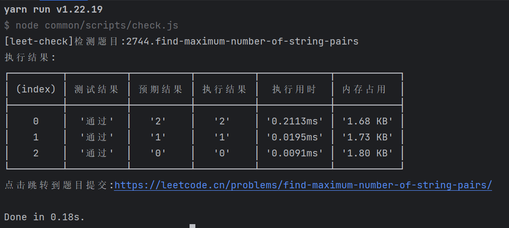
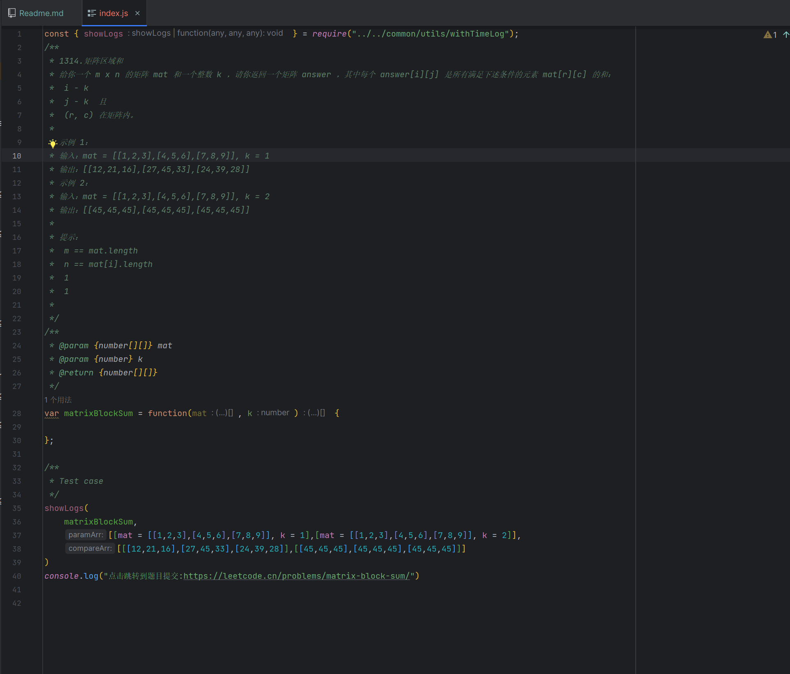

# Leetcode practice

在力扣练习平台!开始你的每日一题!

在编辑器中编写你的代码,简单有效的执行和计时!

我们的目标就是让所有人:
> 只用专注于代码的实现,而非繁琐的输入输出!


## How to use for your self?

### Plan A (Recommended)
The best way to use is by using the `lk/lf/lc` command in your terminal.

### Plan B (Supported)
You can also use the `fork` command on github.com to create your own repository.

### Plan C (Supported)
We also publish a plugin for `WebStorm` and `VS Code`. You can easily use it to create your question.

## Preparation

只需要一个node环境即可.([如何安装node?点我了解](https://nodejs.org/en/learn/getting-started/how-to-install-nodejs))

| 依赖包    | 版本    |
|--------|-------|
| nodejs | `lts` |

## Usage

### 0. 安装依赖

```shell
yarn install # 或者任意你喜欢的包管理工具，如
pnpm install
```

### 1. 获取今天的题目

```shell
yarn leet-create
```

会通过接口获取今日题目，并会在`src`目录下根据`题目的id`+`题目的英文翻译`创建一个目录，并将今日题目和基础示例代码填充到`index.js`中。


### 2. 检验今天的题目

```shell
yarn leet-check
```

此指令会根据今天的题目信息去执行对应的题目文件，输出结果。

```shell
yarn leet-check 

[leet-check]检测题目:2744.find-maximum-number-of-string-pairs
执行结果:
┌─────────┬──────────┬──────────┬──────────┬────────────┬───────────┐
│ (index) │ 测试结果 │ 预期结果 │ 执行结果 │  执行用时  │ 内存占用  │
├─────────┼──────────┼──────────┼──────────┼────────────┼───────────┤
│    0    │  '通过'  │   '2'    │   '2'    │ '0.2113ms' │ '1.68 KB' │
│    1    │  '通过'  │   '1'    │   '1'    │ '0.0195ms' │ '1.73 KB' │
│    2    │  '通过'  │   '0'    │   '0'    │ '0.0091ms' │ '1.80 KB' │
└─────────┴──────────┴──────────┴──────────┴────────────┴───────────┘
点击跳转到题目提交:https://leetcode.cn/problems/find-maximum-number-of-string-pairs/

Done in 0.18s.

```



### 3. 创建自己想要练习的题目

```shell
# 可以使用你喜欢的任意包管理工具,例如 `pnpm`/`npm`
yarn leet-create -i [题目编号或者名称]

# e.g.
yarn leet-create -i 1314
#注意如果遇到id带空格的题目，请使用字符串包裹
# e.g.
yarn leet-create -i "LCP 29"
```

然后会在目录中创建一个模板js文件,目录结构为:

```shell
-src
└── 1314
  └── index.js # 模板js文件 可以替换题目
```




### 4. 检验自己想要练习的结果

```shell
# 可以使用你喜欢的任意包管理工具,例如 `pnpm`/`npm`
yarn leet-check -i [题目编号或者名称]

e.g.
yarn leet-check -i 1314
```

会出现其用时以及内存占用:

```shell
D:\GitHub\leetcode-practice> yarn leet-check -i 1314 
yarn run v1.22.19
$ node common/scripts/check.js -i 1314
[leet-check]检测题目:1314.matrix-block-sum
执行结果:
┌─────────┬──────────┬──────────────────────────────────────┬──────────────────────────────────────┬────────────┬───────────┐
│ (index) │ 测试结果 │               预期结果               │               执行结果               │  执行用时  │ 内存占用  │
├─────────┼──────────┼──────────────────────────────────────┼──────────────────────────────────────┼────────────┼───────────┤
│    0    │  '通过'  │ '[[12,21,16],[27,45,33],[24,39,28]]' │ '[[12,21,16],[27,45,33],[24,39,28]]' │ '0.2553ms' │ '2.05 KB' │
│    1    │  '通过'  │ '[[45,45,45],[45,45,45],[45,45,45]]' │ '[[45,45,45],[45,45,45],[45,45,45]]' │ '0.0224ms' │ '2.13 KB' │
└─────────┴──────────┴──────────────────────────────────────┴──────────────────────────────────────┴────────────┴───────────┘
点击跳转到题目提交:https://leetcode.cn/problems/matrix-block-sum/

Done in 0.18s.

```

当然如果你之前执行了`leet-create -i`指令创建的题目，也可以不指定号码，系统会自动读取上一个指定创建的题目进行监测。

```shell
D:\GitHub\leetcode-practice> yarn leet-check -i     
yarn run v1.22.19
$ node common/scripts/check.js -i
[leet-check]检测题目:1314.matrix-block-sum
执行结果:
┌─────────┬──────────┬──────────────────────────────────────┬──────────────────────────────────────┬────────────┬───────────┐
│ (index) │ 测试结果 │               预期结果               │               执行结果               │  执行用时  │ 内存占用  │
├─────────┼──────────┼──────────────────────────────────────┼──────────────────────────────────────┼────────────┼───────────┤
│    0    │  '通过'  │ '[[12,21,16],[27,45,33],[24,39,28]]' │ '[[12,21,16],[27,45,33],[24,39,28]]' │ '0.2537ms' │ '2.05 KB' │
│    1    │  '通过'  │ '[[45,45,45],[45,45,45],[45,45,45]]' │ '[[45,45,45],[45,45,45],[45,45,45]]' │ '0.0231ms' │ '2.13 KB' │
└─────────┴──────────┴──────────────────────────────────────┴──────────────────────────────────────┴────────────┴───────────┘
点击跳转到题目提交:https://leetcode.cn/problems/matrix-block-sum/

Done in 0.19s.

```


### 5. 获取随机题目

```shell
yarn leet-create -r
```

会获取一个当前src目录中未出现过的题目并创建:

```shell
 D:\GitHub\leetcode-practice> yarn leet-create -r     
yarn run v1.22.19
$ node common/scripts/create.js -r
[fulfillQuestion]题目[43][字符串相乘]已完成填充.
Done in 1.78s.
```

### 6. 检验随机题目

```shell
# 可以使用你喜欢的任意包管理工具,例如 `pnpm`/`npm`
yarn leet-check -r
```

会检验刚刚创建出的随机题目:

```shell
 D:\GitHub\leetcode-practice> yarn leet-check -r
yarn run v1.22.19
$ node common/scripts/check.js -r
[leet-check]检测当前随机题目:43.multiply-strings
执行结果:
┌─────────┬──────────┬───────────┬───────────┬────────────┬───────────┐
│ (index) │ 测试结果 │ 预期结果  │ 执行结果  │  执行用时  │ 内存占用  │
├─────────┼──────────┼───────────┼───────────┼────────────┼───────────┤
│    0    │  '通过'  │   '"6"'   │   '"6"'   │ '0.2153ms' │ '1.76 KB' │
│    1    │  '通过'  │ '"56088"' │ '"56088"' │ '0.0232ms' │ '2.02 KB' │
└─────────┴──────────┴───────────┴───────────┴────────────┴───────────┘
点击跳转到题目提交:https://leetcode.cn/problems/multiply-strings/

Done in 0.19s.

```

## Contributor

[](https://github.com/wh131462)
[](https://github.com/SmallTeddy)
[](https://github.com/Hedwig-Fang)
