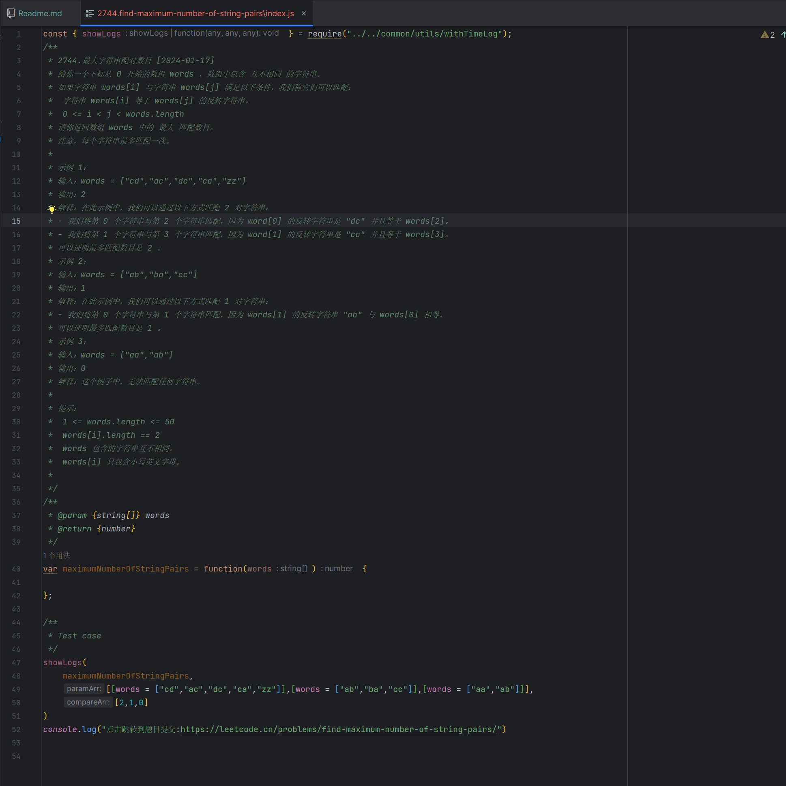
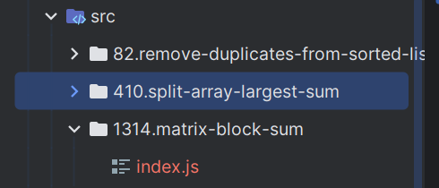
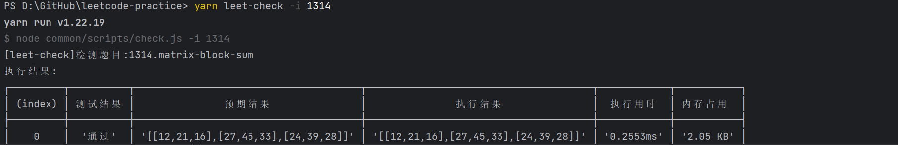

# Leetcode practice

力扣练习库!开始你的每日一题!
在编辑器中编写你的代码,简单有效的执行和计时!

## TO-DO List

### 功能

#### 优先级高

- [ ] 私人项目部署的实现方案

#### 优先级中

- [ ] 创建一个单独指令lc,用于项目的单独指令,忽略npm/yarn/pnpm的执行差异/歧义

#### 优先级低

- [ ] 实现在编辑器中预览图片(感觉可以不做)


#### 代码优化及基础建设

- [ ] 优化随机题目的随机方式，减少请求
- [ ] commonJS -> ES6 Module
- [ ] 优化src下代码结构
- [ ] 封装npm包，方便后续做成编辑器插件

### 已完归档

- [x] 1.模板:获取js的函数体并替换生成文件中的@function
- [x] 2.模板:从detail中获取输入用例的数据填充@Testcase
- [x] 3.模板:获取跳转每日一题的链接替换@url
- [x] 4.函数:优化时间和资源统计函数
- [x] 5.优化创建时的体验，添加重复时候的确认覆盖或者添加额外符号
- [x] 6.特殊数据结构的处理(链表ListNode,树TreeNode,无向连通图Node)的处理
- [x] 7.创建某一特定编号的题目脚本,以及实现随机题目【随机题目汇集本地题目，然后排除自己本地存在的题目进行随机】

## How to use for yourself ?

fork分支`template`的内容,其非内容部分会与主分支保持同步,意思是去除部分我的题目代码,然后使用指令创建你自己的题解即可!

## Preparation

只需要一个node环境即可.([如何安装node?点我了解](https://nodejs.org/en/learn/getting-started/how-to-install-nodejs))

| 依赖包    | 版本    |
|--------|-------|
| nodejs | `lts` |

## Usage

### 0. 安装依赖

```shell
yarn install # 或者任意你喜欢的包管理工具，如
pnpm install
```

### 1. 获取今天的题目

```shell
yarn leet-create
```

会通过接口获取今日题目，并会在`src`目录下根据`题目的id`+`题目的英文翻译`创建一个目录，并将今日题目和基础示例代码填充到`index.js`中。




### 2. 检验今天的题目

```shell
yarn leet-check
```

此指令会根据今天的题目信息去执行对应的题目文件，输出结果。
> NOTE:缓存的实现是在`commom/resouces/store.json`,如果只想让内容在本地存在,不上传到个人项目中的话,执行`git update-index --aussume-unchanged common/resources/store.json`来忽略本地的文件变更即可。
>

```shell
yarn leet-check 

[leet-check]检测题目:2744.find-maximum-number-of-string-pairs
执行结果:
┌─────────┬──────────┬──────────┬──────────┬────────────┬───────────┐
│ (index) │ 测试结果 │ 预期结果 │ 执行结果 │  执行用时  │ 内存占用  │
├─────────┼──────────┼──────────┼──────────┼────────────┼───────────┤
│    0    │  '通过'  │   '2'    │   '2'    │ '0.2113ms' │ '1.68 KB' │
│    1    │  '通过'  │   '1'    │   '1'    │ '0.0195ms' │ '1.73 KB' │
│    2    │  '通过'  │   '0'    │   '0'    │ '0.0091ms' │ '1.80 KB' │
└─────────┴──────────┴──────────┴──────────┴────────────┴───────────┘
点击跳转到题目提交:https://leetcode.cn/problems/find-maximum-number-of-string-pairs/

Done in 0.18s.

```


### 3. 创建自己想要练习的题目

```shell
# 可以使用你喜欢的任意包管理工具,例如 `pnpm`/`npm`
yarn leet-create -i [题目编号或者名称]

# e.g.
yarn leet-create -i 1314
#注意如果遇到id带空格的题目，请使用字符串包裹
# e.g.
yarn leet-create -i "LCP 29"
```

然后会在目录中创建一个模板js文件,目录结构为:

```shell
-src
└── 1314
  └── index.js # 模板js文件 可以替换题目
```





### 4. 检验自己想要练习的结果

```shell
# 可以使用你喜欢的任意包管理工具,例如 `pnpm`/`npm`
yarn leet-check -i [题目编号或者名称]

e.g.
yarn leet-check -i 1314
```

会出现其用时以及内存占用:

```shell
D:\GitHub\leetcode-practice> yarn leet-check -i 1314 
yarn run v1.22.19
$ node common/scripts/check.js -i 1314
[leet-check]检测题目:1314.matrix-block-sum
执行结果:
┌─────────┬──────────┬──────────────────────────────────────┬──────────────────────────────────────┬────────────┬───────────┐
│ (index) │ 测试结果 │               预期结果               │               执行结果               │  执行用时  │ 内存占用  │
├─────────┼──────────┼──────────────────────────────────────┼──────────────────────────────────────┼────────────┼───────────┤
│    0    │  '通过'  │ '[[12,21,16],[27,45,33],[24,39,28]]' │ '[[12,21,16],[27,45,33],[24,39,28]]' │ '0.2553ms' │ '2.05 KB' │
│    1    │  '通过'  │ '[[45,45,45],[45,45,45],[45,45,45]]' │ '[[45,45,45],[45,45,45],[45,45,45]]' │ '0.0224ms' │ '2.13 KB' │
└─────────┴──────────┴──────────────────────────────────────┴──────────────────────────────────────┴────────────┴───────────┘
点击跳转到题目提交:https://leetcode.cn/problems/matrix-block-sum/

Done in 0.18s.

```

当然如果你之前执行了`leet-create -i`指令创建的题目，也可以不指定号码，系统会自动读取上一个指定创建的题目进行监测。

```shell
D:\GitHub\leetcode-practice> yarn leet-check -i     
yarn run v1.22.19
$ node common/scripts/check.js -i
[leet-check]检测题目:1314.matrix-block-sum
执行结果:
┌─────────┬──────────┬──────────────────────────────────────┬──────────────────────────────────────┬────────────┬───────────┐
│ (index) │ 测试结果 │               预期结果               │               执行结果               │  执行用时  │ 内存占用  │
├─────────┼──────────┼──────────────────────────────────────┼──────────────────────────────────────┼────────────┼───────────┤
│    0    │  '通过'  │ '[[12,21,16],[27,45,33],[24,39,28]]' │ '[[12,21,16],[27,45,33],[24,39,28]]' │ '0.2537ms' │ '2.05 KB' │
│    1    │  '通过'  │ '[[45,45,45],[45,45,45],[45,45,45]]' │ '[[45,45,45],[45,45,45],[45,45,45]]' │ '0.0231ms' │ '2.13 KB' │
└─────────┴──────────┴──────────────────────────────────────┴──────────────────────────────────────┴────────────┴───────────┘
点击跳转到题目提交:https://leetcode.cn/problems/matrix-block-sum/

Done in 0.19s.

```



### 5. 获取随机题目

```shell
yarn leet-create -r
```

会获取一个当前src目录中未出现过的题目并创建:

```shell
 D:\GitHub\leetcode-practice> yarn leet-create -r     
yarn run v1.22.19
$ node common/scripts/create.js -r
[store]数据存储成功[random-question-info]:[[object Object]]
[fulfillQuestion]题目[43][字符串相乘]已完成填充.
Done in 1.78s.
```

### 6. 检验随机题目

```shell
# 可以使用你喜欢的任意包管理工具,例如 `pnpm`/`npm`
yarn leet-check -r
```

会检验刚刚创建出的随机题目:

```shell
 D:\GitHub\leetcode-practice> yarn leet-check -r
yarn run v1.22.19
$ node common/scripts/check.js -r
[leet-check]检测当前随机题目:43.multiply-strings
执行结果:
┌─────────┬──────────┬───────────┬───────────┬────────────┬───────────┐
│ (index) │ 测试结果 │ 预期结果  │ 执行结果  │  执行用时  │ 内存占用  │
├─────────┼──────────┼───────────┼───────────┼────────────┼───────────┤
│    0    │  '通过'  │   '"6"'   │   '"6"'   │ '0.2153ms' │ '1.76 KB' │
│    1    │  '通过'  │ '"56088"' │ '"56088"' │ '0.0232ms' │ '2.02 KB' │
└─────────┴──────────┴───────────┴───────────┴────────────┴───────────┘
点击跳转到题目提交:https://leetcode.cn/problems/multiply-strings/

Done in 0.19s.

```

## Scripts API Document

| script      | 参数               | 说明                                                  |
|-------------|------------------|-----------------------------------------------------|
| leet-create | [-i [题目编号]][-r]  | 创建一个题目,不带参数获取今日题目,`-i` 参数指定题号去获取，`-r` 随机题目          |
| leet-check  | [-i [题目编号]][-r]       | 执行检测一个题目,不带参数检测今日题目,`-i` 参数指定题号去检测，`-r` 检测上一个随机出的题目 |

> note:
> 名词解释: 题目编号是leet-code为其分配的唯一id,如`1314`对应题目`矩阵区域和`

## Contributor

[EternalHeart](https://github.com/wh131462)
[SmallTeddy](https://github.com/SmallTeddy)
