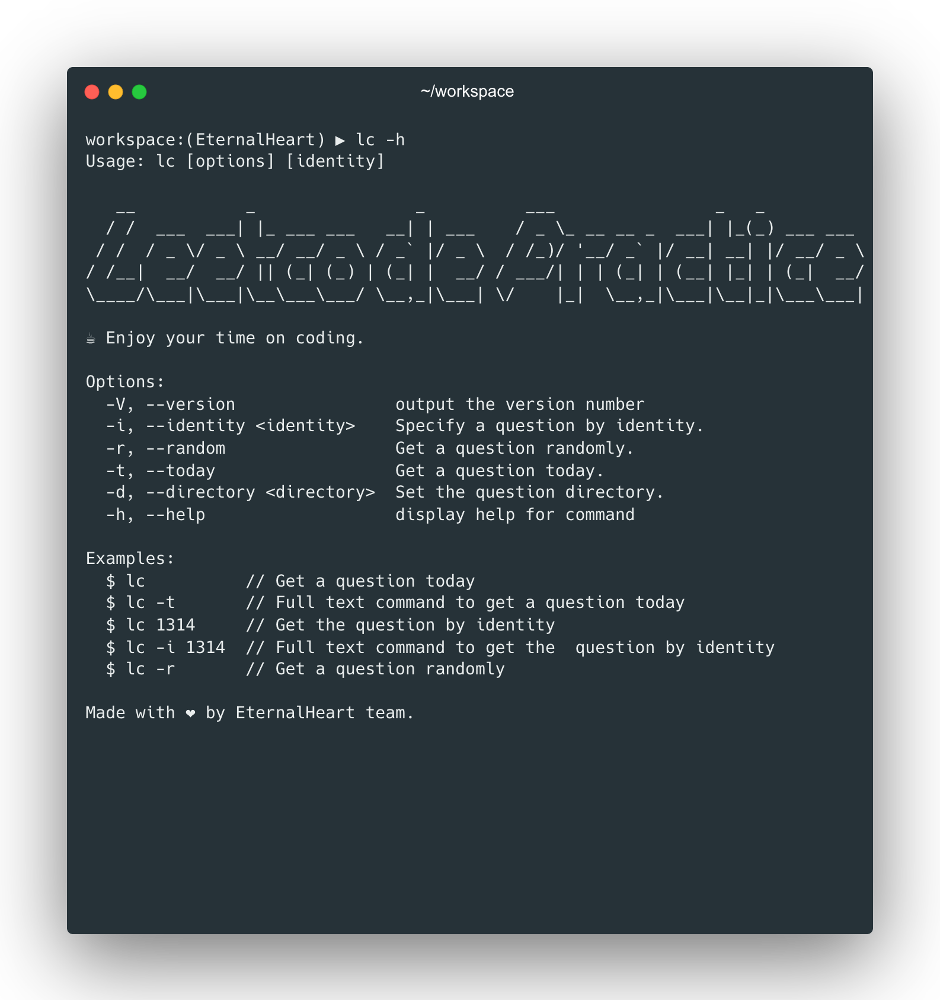

# Leetcode practice

**中文文档**|[英文文档](../README.md)|[日文文档](./README_JP.md)|[韩文文档](./README_KR.md)

## 简介

一句话介绍：“在编辑器中开始练习你的`leetcode`每日一题！”

如果，你想要在编辑器中编写你的题解...

如果，你想要简单快速的获取每日一题...

如果，你想要创建你自己的题解仓库...

那么，`leetcode-practice`将满足你的一切想要！

## 预览



## 我应该怎么使用？（三种方案供你选择）

### 方案 A : CLI (推荐使用)

最好的也是最自由的使用方法是：在终端中使用我们的脚手架，通过三个核心指令:`lk`,`lf`,`lc`,来创建和检查你的题解。

### 方案 B : fork (受支持的)

你也可以使用`github`的`fork`功能来创建我们的项目副本，然后，直接使用项目内置指令进行题解的创建和检查。

### 方案 C : plugin (受支持的)

你同样可以使用我们发布在插件市场的插件`leetcode-practice`来进行交互式的创建和检查题解。（支持两个主流编辑器：`WebStorm` 和 `VS Code`）

## 预备条件

不管哪种方案，只需要一个node环境即可.([不知道如何安装node?点我进行了解](https://nodejs.org/en/learn/getting-started/how-to-install-nodejs))

| 依赖包    | 版本    |
|--------|-------|
| nodejs | `lts` |

## 安装

### 一.全局安装脚手架 (方案 A)

你可以使用任意npm包管理软件（例如`npm`,`yarn`,`pnpm`等）的全局安装方法进行安装。

```shell
# 使用npm进行安装
npm install -g leetcode-practice
# 使用pnpm进行安装,因为默认就是全局安装的
pnpm install leetcode-practice
# 使用yarn进行安装
yarn global install leetcode-practice
```

### 二.使用`fork`创建你自己的`leetcode-practice`仓库副本 (方案 B)

#### 常规方法
1. 打开我们的项目地址:[leetcode-practice](https://github.com/wh131462/leetcode-practice)


2. 点击`fork`按钮

你会看到这样的一个页面，然后修改仓库名和描述，确认勾选`Copy the master branch only`


3. 点击确认创建，等待创建


4. 创建完成，然后拉取这个仓库愉快地开始你的解题吧！


#### 简便方法
1. 拉取我们的仓库到本地

```shell
git clone https://github.com/wh131462/leetcode-practice.git
```

2. 执行我们的部署脚本

```shell
# 使用你喜欢的包管理器进行执行脚本即可
npm run easy-fork
```

3. 完成部署

### 三.在编辑器的插件市场安装插件[WebStorm/VS code] (方案 C)

待开发...

## 使用方法

### CLI的使用

#### lc
##### 1. 帮助文档
```shell
lc -h 
```
```shell

```

#### lk

#### lf

### fork项目的使用

### 插件的使用

待开发...

## Contributor

[](https://github.com/wh131462)
[](https://github.com/SmallTeddy)
[](https://github.com/Hedwig-Fang)
