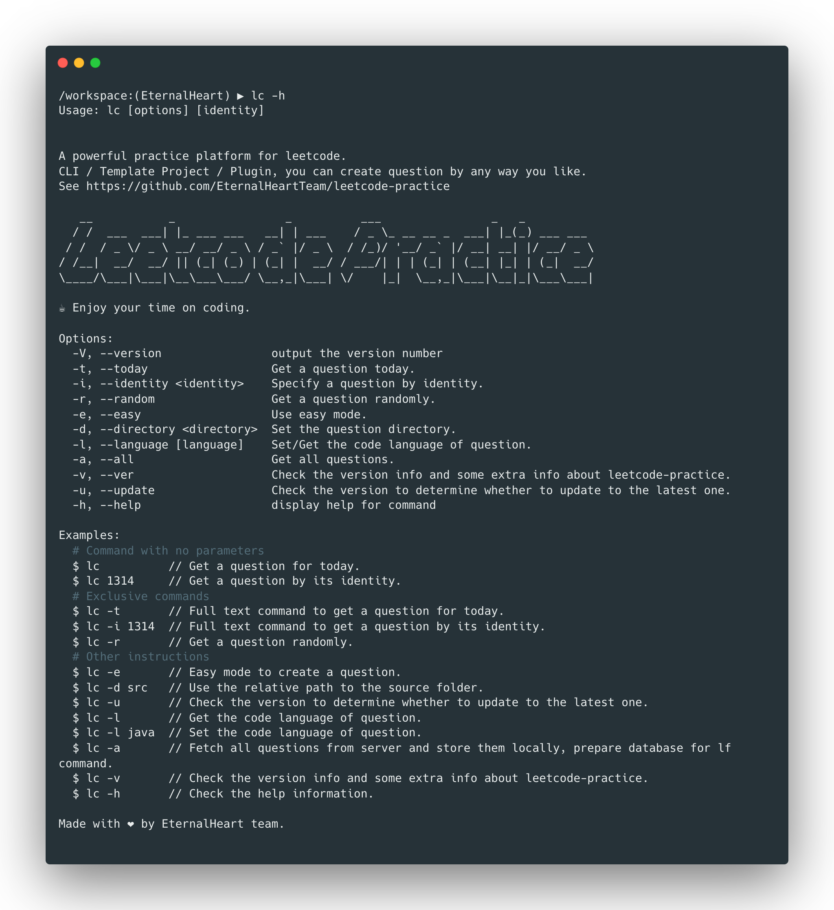
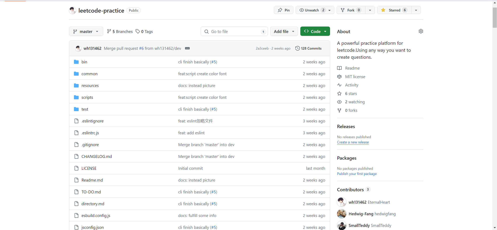
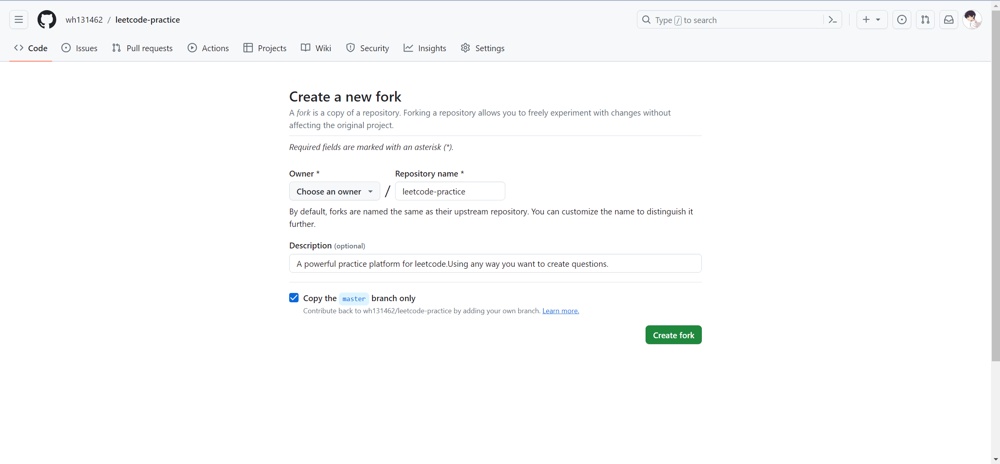
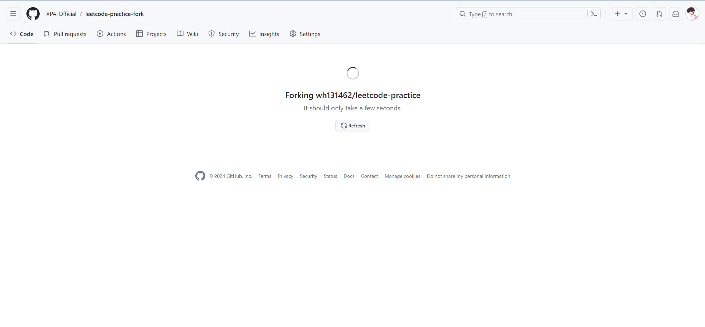
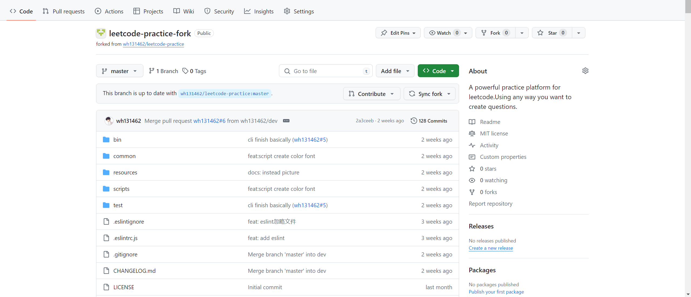

# Leetcode practice

[중국어 문서](./README_CN.md)|[영어 문서](../README.md)|[일본어 문서](./README_JP.md)|**한국어 문서**

## 소개

한 문장으로 설명하면: "에디터에서 `LeetCode` 매일 한 문제를 연습하세요!"

만약 당신이 에디터에서 당신의 문제 해결을 작성하고 싶다면...

만약 당신이 매일 한 문제를 간편하고 빠르게 받고 싶다면...

만약 당신이 자신의 문제 해결 저장소를 만들고 싶다면...

그러면 `LeetCode 연습`이 당신의 모든 요구를 충족시켜줄 것입니다!

## 미리보기



## 어떻게 사용할까요? (3가지 옵션)

### 옵션 A: CLI (추천)

가장 좋고 자유로운 사용 방법은 터미널에서 우리의 스캐폴딩을 사용하여 세 가지 핵심 명령어 `lk`, `lf`, `lc`를 사용하여 당신의 문제를 생성하고 검사하는 것입니다.

[설치](#전역-스캐폴딩-설치-(옵션-A)) · [사용](#CLI의-사용)

### 옵션 B: fork (지원됨)

`github`의 `fork` 기능을 사용하여 프로젝트의 복제본을 만들고, 프로젝트 내부 명령을 사용하여 문제를 생성하고 검사할 수 있습니다.

[설치](#fork를-사용하여-나만의-Leetcode-연습-저장소-복제-(옵션-B)) · [사용](#fork-프로젝트의-사용)

### 옵션 C: 플러그인 (지원됨)

플러그인 시장에서 배포된 `LeetCode 연습` 플러그인을 사용하여 대화 형으로 문제를 생성하고 검사할 수도 있습니다. (`WebStorm` 및 `VS Code`와 같은 두 가지 주요 편집기를 지원합니다.)

[설치](#플러그인-마켓에서-플러그인-설치-(옵션-C)) · [사용](#플러그인의-사용)

## 준비 사항

| 의존성 패키지 | 버전 |
|--------------|----|
| nodejs       | lts |
| git          | lts |

> 참고: nodejs:[nodejs 설치 안내](https://nodejs.org/en/learn/getting-started/how-to-install-nodejs)
>
> git:[git 다운로드 링크](https://git-scm.com/downloads)

## 설치

### 전역 스캐폴딩 설치 (옵션 A)

원하는 npm 패키지 관리 소프트웨어(예: `npm`, `yarn`, `pnpm` 등)를 사용하여 전역 설치를 수행할 수 있습니다.

```shell
# npm을 사용하여 설치
npm install -g leetcode-practice
# pnpm을 사용하여 설치
pnpm install -g leetcode-practice
# yarn을 사용하여 설치
yarn global install leetcode-practice
```

### fork를 사용하여 나만의 Leetcode 연습 저장소 복제 (옵션 B)

#### 일반적인 방법
1. 우리의 프로젝트 주소를 엽니다: [Leetcode 연습](https://github.com/wh131462/leetcode-practice)



2. `fork` 버튼을 클릭합니다.

다음과 같은 페이지가 표시됩니다. 그런 다음 리포지토리 이름과 설명을 수정하고, `Copy the master branch only`를 선택하십시오.



3. 확인하여 생성을 기다립니다.



4. 생성이 완료되면 리포지토리를 가져와서 문제 해결을 시작할 수 있습니다!



#### 간편한 방법

1. 로컬로 리포지토리를 가져옵니다.

```shell
git clone https://github.com/wh131462/leetcode-practice.git
```

2. 배포 스크립트를 실행합니다.

```shell
# 원하는 패키지 관리자로 스크립트를 실행하십시오.
npm run easy-fork
```

3. 배포 완료

### 플러그인 마켓에서 플러그인 설치 (옵션 C)

개발 중...

## 사용법

### CLI의 사용

#### 1. 문제 생성 - `lc`

##### [1]. 오늘의 문제 가져오기 - [`-t`/`--today`]

터미널에서 `lc` 명령어를 입력하면 현재 터미널 작업 영역에 오늘의 문제가 기본적으로 가져와집니다.

```shell
lc 
# 완전한 명령어
lc -t
```

오늘의 문제 가져오기 예시:

```shell
# 예를 들어 현재 실행 디렉토리가 src 디렉토리인 경우
➜  src git:(dev) ✗ lc
MODE: today
문제[2867.통계 트리에서 유효한 경로 수 세기] 가져오기 성공!
문제 파일 주소는: /home/wh131462/workspace/leetcode-practice/src/2867.count-valid-paths-in-a-tree/index.js
```

##### [2]. 특정 문제 가져

오기 - [`-i`/`--identity`]

터미널에서 `lc` 명령어 다음에 해당 문제 번호를 입력하면 현재 작업 영역에서 해당 문제를 가져옵니다.

```shell
lc 1314
# 완전한 명령어
lc -i 1314
# 큰따옴표(")를 사용하여 번호를 둘러싸면 문제 번호를 정확하게 지정할 수 있습니다. 특히 공백이 포함된 문제 번호의 경우에 유용합니다.
lc -i "LCP 50"
```

특정 문제 가져오기 예시:

```shell
➜  src git:(dev) ✗ lc "LCP 50"
MODE: identity
문제[LCP 50.보석 공급] 가져오기 성공!
문제 파일 주소는: /home/wh131462/workspace/leetcode-practice/src/LCP 50.WHnhjV/index.js
```

##### [3]. 무작위 문제 가져오기 - [`-r`/`--random`]

터미널에서 `lc` 명령어 뒤에 `-r` 매개변수를 추가하면 현재 작업 영역에서 무작위 문제를 가져옵니다. 현재 디렉토리에 문제가 없는 경우 우선적으로 가져옵니다.

```shell
# 완전한 명령어
lc -r
```

무작위 문제 가져오기 예시:

```shell
➜  src git:(dev) ✗ lc -r
MODE: random
문제[14.가장 긴 공통 접두사] 가져오기 성공!
문제 파일 주소는: /home/wh131462/workspace/leetcode-practice/src/14.longest-common-prefix/index.js
```

##### [5]. 간편 생성 모드(대화형 생성) - [`-e`/`--easy`]

정확한 명령어를 사용하여 빠르게 문제를 생성하는 것 외에도 간단한 생성 모드를 사용하여 대화형으로 문제를 생성할 수도 있습니다.

```shell
lc -e
```

간단한 모드를 사용하여 오늘의 문제 만들기 예시:

```shell
➜  src git:(dev) ✗ lc -e
? 문제 생성 모드를 선택하십시오: today
? 디렉토리 [ /home/wh131462/workspace/leetcode-practice/src ]에서 문제 [ 2867.count-valid-paths-in-a-tree ]를 만드시겠습니까? Yes
문제[2867.count-valid-paths-in-a-tree] 생성 완료!
파일 주소는: /home/wh131462/workspace/leetcode-practice/src/2867.count-valid-paths-in-a-tree/index.js

```

#### 2. 문제 검사 - `lk`

##### [1]. 오늘의 문제 검사 [`-t`/`--today`]

터미널에서 `lk` 명령어를 입력하면 현재 작업 영역에서 오늘의 문제를 검사합니다.

```shell
# 기본적으로 오늘의 문제를 검사합니다.
lk
# 완전한 명령어
lk -t
```

사용 예시:

```shell
# src 디렉토리가 루트 디렉토리로 지정되었습니다.
workspace/leetcode-practice [dev●] » lk -d src -t 
MODE: today
문제[2581.가능한 트리 루트 수를 세는 것] 검사 결과:
┌─────────┬──────────┬──────────┬───────────┬────────────┬───────────┐
│ (index) │ 테스트 결과 │ 예상 결과 │ 실행 결과  │  실행 시간   │ 메모리 사용량 │
├─────────┼──────────┼──────────┼───────────┼────────────┼───────────┤
│    0    │ '미통과' │   '3'    │ undefined │ '0.0921ms' │ '2.52 KB' │
│    1    │ '미통과' │   '5'    │ undefined │ '0.0119ms' │ '2.66 KB' │
└─────────┴──────────┴──────────┴───────────┴────────────┴───────────┘
문제 제출로 이동하려면 클릭하십시오: https://leetcode-cn/problems/count-number-of-possible-root-nodes/
```

##### [2]. 특정 문제 검사 [`-i`/`--identity` + `<identity>`]

터미널에서 `lk` 명령어를 입력하고 문제 번호를 입력하면 현재 작업 영역에서 해당 문제를 검사합니다.

```shell
# 특정 문제 검사
lk 2581
# 완전한 명령어
lk -i 2581
# 큰따옴표(")를 사용하여 번호를 둘러싸면 문제 번호

를 정확하게 지정할 수 있습니다. 특히 공백이 포함된 문제 번호의 경우에 유용합니다.
lk "LCP 50"
```
특정 문제 검사 사용 예시:

```shell
workspace/leetcode-practice [dev●] » lk -d src 2581
MODE: identity
문제[2581.가능한 트리 루트 수를 세는 것] 검사 결과:
┌─────────┬──────────┬──────────┬───────────┬────────────┬───────────┐
│ (index) │ 테스트 결과 │ 예상 결과 │ 실행 결과  │  실행 시간   │ 메모리 사용량 │
├─────────┼──────────┼──────────┼───────────┼────────────┼───────────┤
│    0    │ '통과'    │   '3'    │ '3'       │ '0.1668ms' │ '2.52 KB' │
│    1    │ '통과'    │   '5'    │ '5'       │ '0.0234ms' │ '2.66 KB' │
└─────────┴──────────┴──────────┴───────────┴────────────┴───────────┘
문제 제출로 이동하려면 클릭하십시오: https://leetcode-cn/problems/count-number-of-possible-root-nodes/
```

##### [3]. 무작위로 가져온 문제 검사 [`-r`/`--random`]

터미널에서 `lk` 명령어를 입력하고 `-r` 매개변수를 사용하면 최근에 가져온 무작위 문제를 현재 작업 영역에서 검사합니다.

```shell
# 완전한 명령어
lk -r
```
사용 예시:

```shell
workspace/leetcode-practice [dev●] » lk -r 
MODE: random
문제[41.누락된 첫 번째 양의 정수] 검사 결과:
┌─────────┬──────────┬──────────┬───────────┬────────────┬───────────┐
│ (index) │ 테스트 결과 │ 예상 결과 │ 실행 결과  │  실행 시간  │ 메모리 사용량 │
├─────────┼──────────┼──────────┼───────────┼────────────┼───────────┤
│    0    │ '미통과' │   '3'    │ undefined │ '0.0896ms' │ '2.42 KB' │
│    1    │ '미통과' │   '2'    │ undefined │ '0.0110ms' │ '2.56 KB' │
│    2    │ '미통과' │   '1'    │ undefined │ '0.0045ms' │ '2.56 KB' │
└─────────┴──────────┴──────────┴───────────┴────────────┴───────────┘
문제 제출로 이동하려면 클릭하십시오: https://leetcode-cn/problems/first-missing-positive/
```

> 참고: 이 명령을 실행하기 전에 반드시 `lc -r`을 실행하여 무작위 문제를 만들어야 합니다.

##### [4]. 간편 모드(대화형 검사) [`-e`/`--easy`]

터미널에서 `lk` 명령어를 입력하고 `-e` 매개변수를 사용하면 대화형으로 문제를 검사할 수 있습니다.
```shell
# 완전한 명령어
lk -e
```

간단한 모드를 사용하여 특정 문제 검사:

```shell
workspace/leetcode-practice [dev●] » lk -e
? 검사 모드를 선택하십시오: identity
? 문제 번호를 입력하십시오: 41
? 현재 디렉토리 [ /Users/mac-106/wh131462/workspace/leetcode-practice ]에서 문제 [ 41.first-missing-positive ]를 검사하시겠습니까? Yes
┌─────────┬──────────┬──────────┬───────────┬────────────┬───────────┐
│ (index) │ 테스트 결과 │ 예상 결과 │ 실행 결과  │  실행 시간  │ 메모리 사용량 │
├─────────┼──────────┼──────────┼───────────┼────────────┼───────────┤
│    0    │ '미통과' │   '3'    │ undefined │ '0.0969ms' │ '2.42 KB' │
│    1    │ '미통과' │   '2'    │ undefined │ '0.0139ms' │ '2.56 KB' │
│    2    │ '미통과' │   '1'    │ undefined │ '0.0051ms' │ '2.56 KB' │
└─────────┴──────────┴──────────┴───────────┴────────────┴───────────┘
문제 제출로 이동하려면 클릭하십시오: https://leetcode-cn/problems/first-missing-positive/
문제[41.first-missing-positive] 검사 완료!
파일 주소는: /Users/mac-106/wh131462/workspace/leetcode-practice/41.first-missing-positive/index.js
```

#### 3. 문제 찾기 - `lf`

- 개발 중...

##### [1]. 문제 목록 보기[미개발]

#### 4. 일반 매개변수

##### [1]. 현재 프로그래밍 언어 가져오거나 지정하기 - [`-l`/`-language` [언어]]

`-l`을 인수 없이 사용하여 현재 프로그래밍 언어 설정을 가져올 수 있습니다. 또한 언어 매개변수를 지정하여 현재 CLI의 언어 환경을 지정된 언어로 설정할 수도 있습니다.
```shell
# lc/lk/lf에서 이 매개변수는 동일하게 동작합니다
lc -l 
lk -l java
```

사용 예시:

```shell
# 언어 환경 가져오기
➜  leetcode-practice git:(dev) ✗ lc -l
현재 CLI 언어 환경은:javascript
# 언어 환경 변경
➜  leetcode-practice git:(dev) ✗ lc -l java
? CLI의 언어 환경을 설정하시겠습니까 (옵션과 일치하는 경우 Enter 키를 눌러 확인하십시오) java
언어 환경이 설정되었습니다: java

```

> 참고: 이 환경에서는 테스트 케이스를 실행할 수 없습니다.

##### [2]. 디렉터리 지정 - [`-d`/`-directory`]

`생성` 및 `검사` 명령은 현재 작업 디렉터리를 기준으로 상대 주소를 지정하는 `-d` 매개변수를 사용할 수 있습니다. 지정된 디렉터리에서 생성 또는 검사 작업이 수행됩니다.
```shell
# 현재 디렉터리의 하위 디렉터리 src를 생성 디렉터리로 지정
lc -d src -t
# 현재 디렉터리의 하위 디렉터리 src를 검사 디렉터리로 지정
lk -d src -i
```

사용 예시:

```shell
➜  src git:(dev) ✗ lc -d src -t
MODE: today
문제[2867.트리에서 유효한 경로 수 세기]가 생성되었습니다!
문제 파일 주소는:/home/wh131462/workspace/leetcode-practice/src/src/2867.count-valid-paths-in-a-tree/index.js
```

> 참고: 지정된 디렉터리가 존재하지 않으면 빈 디렉터리가 자동으로 생성됩니다.

##### [3]. 버전 확인 [`-V`/`--version`]

```shell
# lc 버전 확인
lc -V
# lk 버전 확인
lk -V
# lf 버전 확인
lf -V
```

lc 버전 확인 예시:

```shell
workspace/leetcode-practice [dev●] » lc -V
0.0.0
```

##### [4]. 업데이트 확인 [`-u`/`--update`]
`-u` 또는 `--update` 매개변수를 사용하여 현재 버전이 최신 버전인지 확인할 수 있습니다. 현재 버전이 최신 버전이 아닌 경우 사용자에게 업데이트를 진행할지 여부를 알립니다.
```shell
lk -u 
lf -u
lc -u
```
```shell
? 자동 감지된 환경은 [프로젝트]입니다. 아닌 경우 선택하고, 맞으면 엔터를 누르십시오. 프로젝트
npm 저장소에서 버전 번호 가져 오기 시작 ...
npm 저장소의 버전 번호를 성공적으로 가져 왔습니다!
github 저장소의 버전 번호 가져 오기 시작 ...
github 저장소의 버전 번호를 성공적으로 가져 왔습니다!
로컬 버전 번호 가져 오기 시작 ...
로컬 버전 번호가 성공적으로 가져 왔습니다!
현재 버전 : [1.0.0] npm 패키지의 최신 버전 : [1.0.1] github 버전 : [1.0.1]
? [프로젝트]에서 업데이트 가능한 버전 [1.0.1] 감지되었습니다. 업데이트를 수행 하시겠습니까? (Y/n) Yes
업데이트 완료 ~ 즐거운 사용 되세요 ~
```

### fork 프로젝트의 사용
##### [0]. 의존성 설치

사용하기 전에 의존성을 설치하기 위해 패키지 관리 도구를 사용하세요.

```shell
# 의존성 설치
npm install
# 또는 yarn (원하는 패키지 관리 도구를 사용할 수 있습니다.)
yarn
```

fork된 프로젝트의 명령어는 CLI의 사용 방법과 매개변수가 동일하지만, 스크립트를 실행하기 위해 `npm run`과 같은 패키지 관리 도구를 사용해야 합니다.

> 참고: 프로젝트의 스크립트는 "src" 디렉토리를 기본적으로 `-d` 매개변수로 지정하여 프로젝트의 루트 디렉토리에 있는 파일을 실행하도록 되어 있습니다. 따라서 모든 명령은 기본적으로 src에서 실행됩니다.

##### [1]. 문제 생성 [`lc`]

CLI의 `lc` 섹션을 참고하여 매개변수를 사용할 수 있습니다: [lc](#1-문제-생성---lc)

간단한 사용 예시:
```shell
# yarn을 사용하여 실행
yarn lc 1314
```
실행 결과:
```shell
# src 디렉토리에 생성됩니다
> yarn lc 1314                 
yarn run v1.22.19
$ node bin/lc.js -d src 1314
MODE: identity
문제[1314.행렬 블록 합]이 생성되었습니다!
문제 파일 주소는: /Users/mac-106/wh131462/workspace/leetcode-practice/src/1314.matrix-block-sum/index.js
✨  Done in 1.06s.
```

##### [2]. 문제 검사 [`lk`]

CLI의 `lk` 섹션을 참고하여 매개변수를 사용할 수 있습니다: [lk](#2-문제-검사---lk)

간단한 사용 예시:
```shell
# yarn을 사용하여 실행
yarn lk 1314
```
실행 결과:
```shell
# src 디렉토리에서 검사됩니다
> yarn lk 1314
yarn run v1.22.19
$ node bin/lk.js -d src 1314
MODE: identity
문제[1314.행렬 블록 합] 검사 결과:
┌─────────┬──────────┬──────────────────────────────────────┬───────────┬────────────┬───────────┐
│ (index) │ 테스트 결과 │               예상 결과               │ 실행 결과  │  실행 시간  │ 메모리 사용량 │
├─────────┼──────────┼──────────────────────────────────────┼───────────┼────────────┼───────────┤
│    0    │ '미통과' │ '[[12,21,16],[27,45,33],[24,39,28]]' │ undefined │ '0.1487ms' │ '2.47 KB' │
│    1    │ '미통과' │ '[[45,45,45],[45,45,45],[45,45,45]]' │ undefined │ '0.0278ms' │ '2.61 KB' │
└─────────┴──────────┴──────────────────────────────────────┴───────────┴────────────┴───────────┘
문제 제출로 이동하려면 클릭하십시오: https://leetcode-cn/problems/matrix-block-sum/
✨  Done in 1.13s.
```

##### [3]. 문제 찾기 [`lf`]

CLI의 `lf` 섹션을 참고하여 매개변수를 사용할 수 있습니다: [lf](#3-문제-찾기---lf)

미개발...

##### [4]. 업데이트 [`update`]

로컬 프로젝트를 업데이트하는 특정 스크립트는 모든 src 디렉토리가 아닌 업데이트를 위해 모든 비-src 디렉토리를 업데이트합니다.

> 참고: 자체적으로 최적화된 변경 코드가 있는 경우 이 단계를 신중하게 수행하십시오! 특별한 경우의 업그레이드 방법은 [특별한 경우의 업그레이드 방법](./update.md)을 참조하십시오!

### 플러그인의 사용

미개발...

## 기여자

[](https://github.com/wh131462)
[](https://github.com/SmallTeddy)
[](https://github.com/Hedwig-Fang)